# About ESLint All

## ESLint是什么

>ESLint最初是由[Nicholas C. Zakas](https://www.nczonline.net/) 于2013年6月创建的开源项目。它的目标是提供一个插件化的javascript代码检测工具。

所以ESLint是一款JavaScript代码检查工具。

代码检查是一种静态的分析，常用于寻找有问题的模式或者代码，并且不依赖具体的编码风格。对大多数编程语言来说都会有代码检查，一般来说编译程序都会内置检查工具。

然而JavaScript是一种动态的弱类型语言，在开发中容易出现错误。因为没有编译程序，为了寻找JavaScript代码中存在的错误就需要在执行过程中不断的调试。而ESLint让程序员在编码的过程中发现问题而不是在执行过程中。

ESLint的初衷是为了让程序员可以创建自己的检测规则。ESLint的所有规则都被设计成可插入的。ESLint的默认规则与其他的插件并没有什么区别，规则本身和测试可以依赖于同样的模式。为了便于人们使用，ESLint也内置了一些规则。

ESLint使用Node.js编写，这样既可以有一个快速的运行环境，同时也便于安装。

## ESLint的特点

### 所有都是可拔插的

* 内置规则和自定义规则共用一套规则API
* 内置的格式化方法和自定义的格式化方法共用一套格式化API
* 额外的规则和格式化方法能够在运行时指定
* 规则和对应的格式化方法并不强制捆绑使用

### 每条规则

* 各自独立
* 可以开启或关闭（没有什么可以被认为“太重要以至于不能关闭”）
* 可以将结果设置成为警告或者错误

### 另外

* ESLint并不推荐任何编码风格，规则是自由的
* 所有内置规则都是泛化的

### 项目

* 通过丰富文档减少沟通成本
* 尽可能的简单透明
* 相信测试的重要性

## [规则](http://eslint.cn/docs/rules/)

为了让开发者对规则有一个更好的理解，ESLint对其进行了分门别类。

所有规则默认都是禁用的。在[配置文件]中，使用`"extends": "eslint: recommanded"` 来启动推荐的规则，报告一些常见的问题，在下文中这些推荐的规则都有一个绿色的✔️标记。

命令行的`--fix`选项用来自动修复规则所报告的问题（目前，大部分是对空白的修复），在下面会有一个橘色的工具钳的图标。

因为规则有很多，所以当遇到一些不清楚的规则的时候，只需要查看下面的表即可。

### Possible Errors

这些规则与 JavaScript 代码中可能的错误或逻辑错误有关：

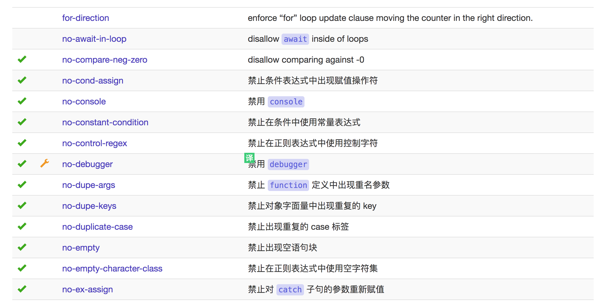
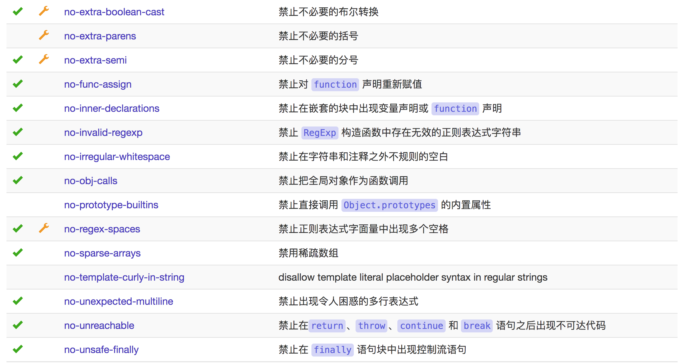
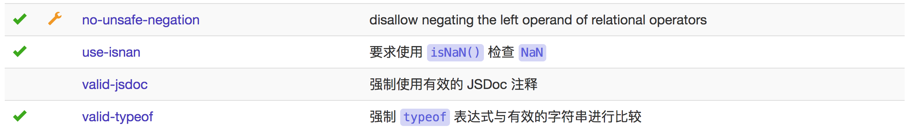

### Best Practices

这些规则是关于最佳实践的，帮助你避免一些问题:

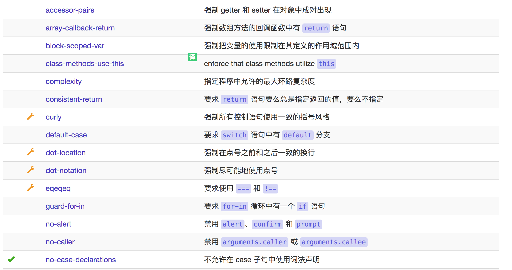
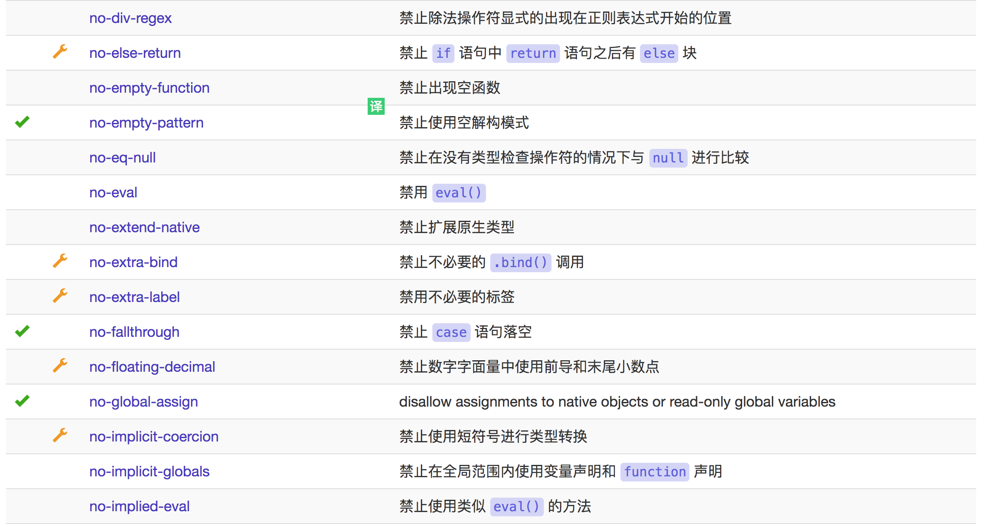
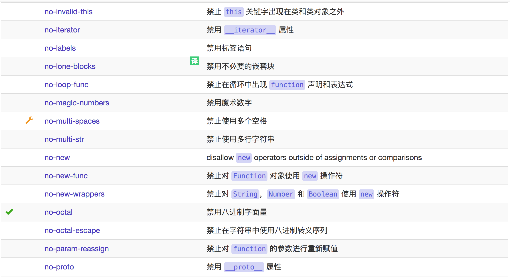
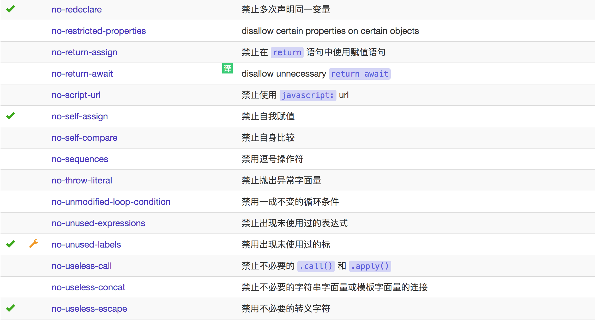
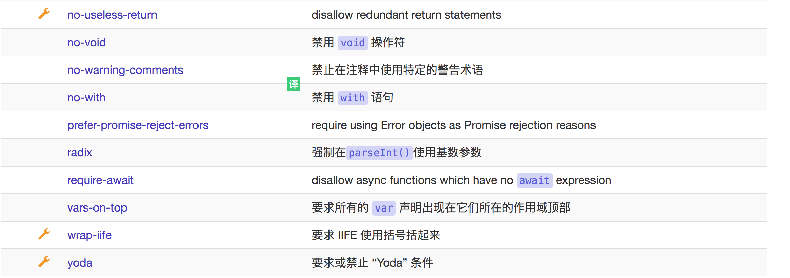

### Strict Mode

该规则与使用严格模式和严格模式指令有关：

### Variables

这些规则与变量声明有关：

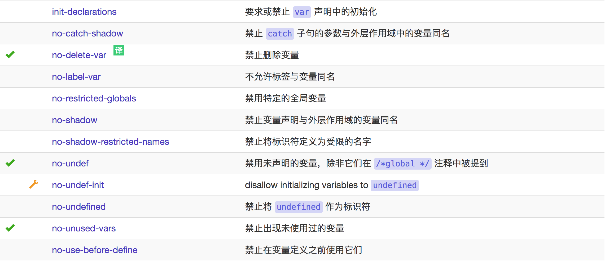

### Node.js and CommonJS

这些规则是关于Node.js 或 在浏览器中使用CommonJS 的：

### Stylistic Issues

这些规则是关于风格指南的，而且是非常主观的：

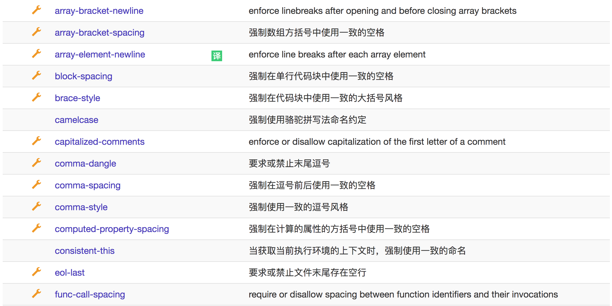
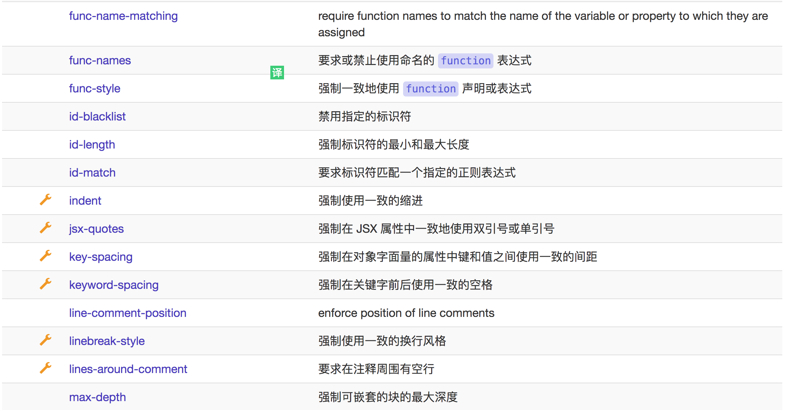
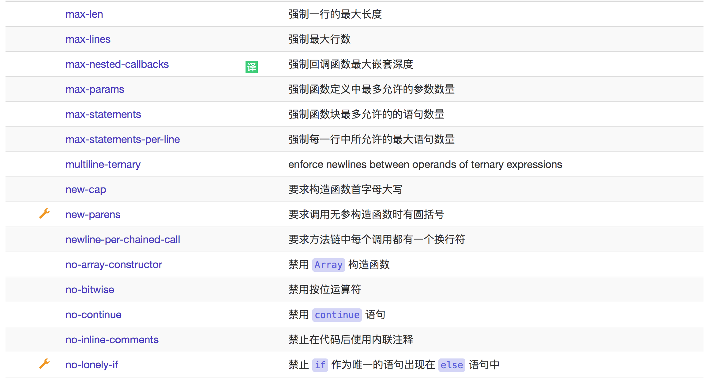
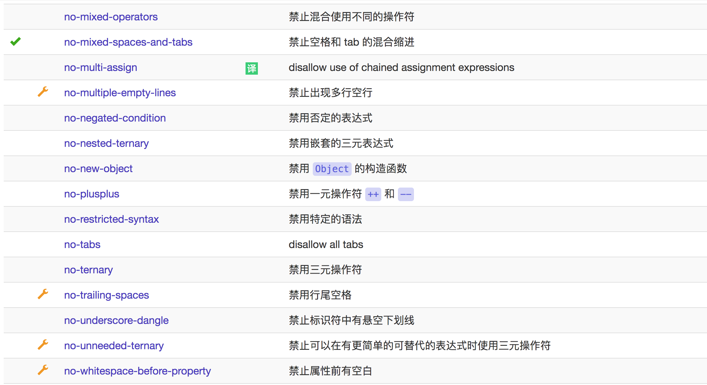

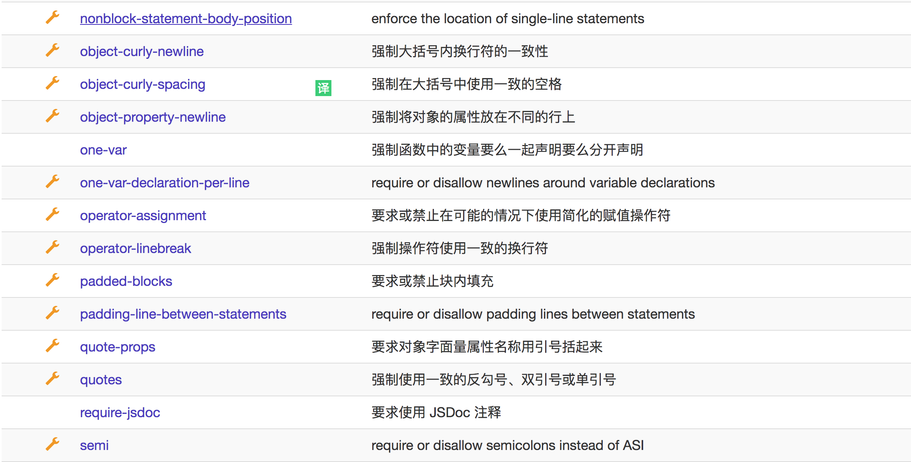
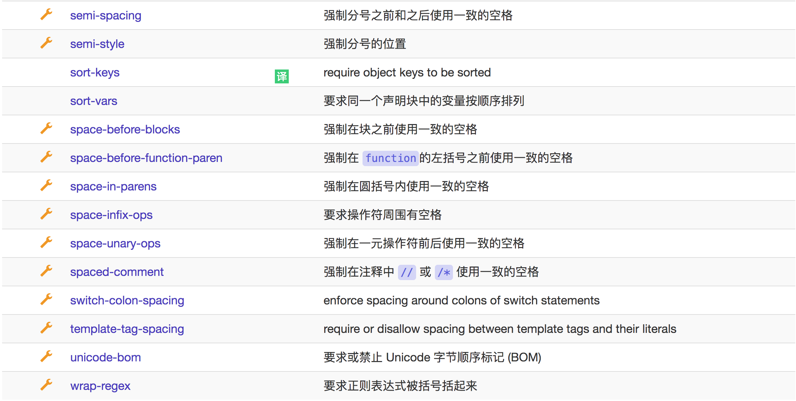

### ECMAScript 6

些规则只与 ES6 有关, 即通常所说的 ES2015：

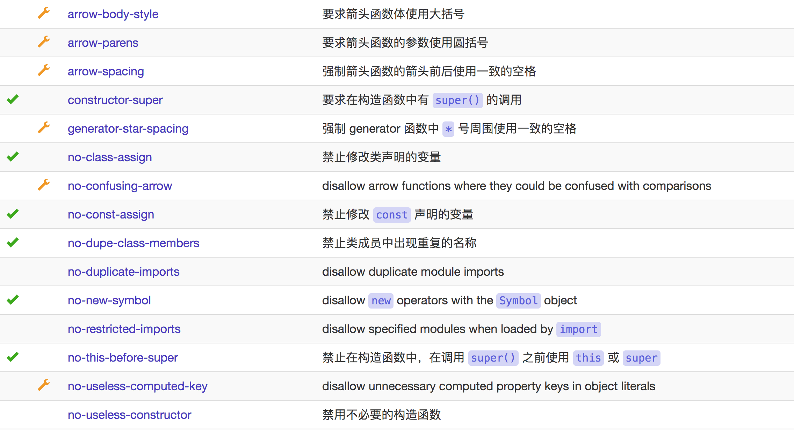
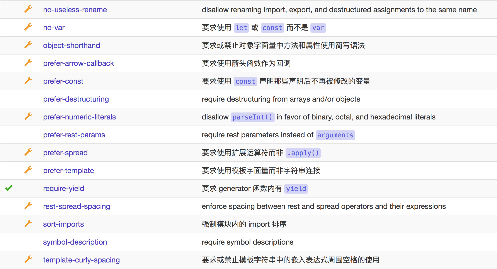
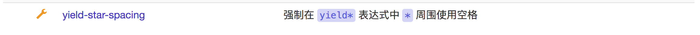