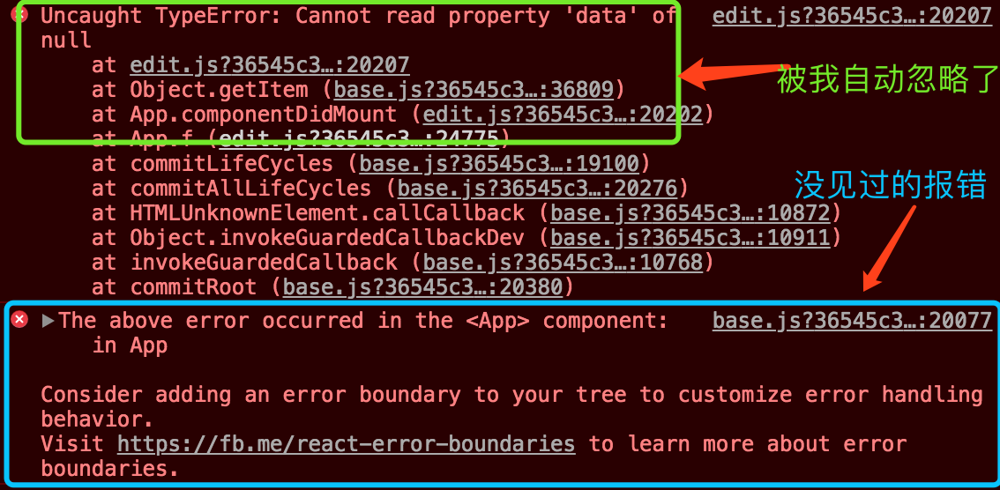

# 零碎代码学知识

## 20180321

### One

最近在开发React相关的一个项目，有一个修改了一些感觉无关紧要的东西，然后悲剧就发生了QAQ。浏览器里报错：



第一个报错因为跟之前存在的错误长的相同被我自动忽略了，应该不是它的影响（不知不觉立了flag）。之后就开始注意到第二个报错，根据这个报错，我发现我没看到它报哪里的问题。于是借助Google娘，找到了答案：

> In the past, JavaScript errors inside components used to corrupt React’s internal state and cause it to emit cryptic errors on next renders. These errors were always caused by an earlier error in the application code, but React did not provide a way to handle them gracefully in components, and could not recover from them。

大致意思就是：在过去，当组件内的JavaScript发生错误的时候，会导致React的内部状态，React没有提供一种机制处理这种错误带来的影响，比如说在下次render的触发错误。

部分UI的JavaScript的错误不应该破坏整个应用，为了解决这个问题，React提出了Error Boundaries（错误边界）这种新的概念。Error Boundaries是一种React组件，它能捕获它的子组件的错误并且去log这些错误以及展示一个备用的UI界面替换出现问题的组件。Error Boundaries能在渲染过程中、生命周期方法中以及在它下面的所有子组件的构造函数里捕获错误。

虽然Error Boundaries可以捕获其子组件发生的错误，但是并不是所有的错误都可以捕获，如下错误是它不能捕获的：

* Event handlers（事件触发的错误）
* Asynchronous code（异步代码出现的错误，例如`setTimeout`或`requestAnimationFrame`的回调）
* Server side rendering（服务器端渲染）
* Error Boundaries自己内部的错误。

如果声明一个Error Boundaries组件？只要在其内部声明`componentDidCatch(error, info)`生命周期方法，那么该组件遍成为了Error Boundaries。如下：

``` javascript
class ErrorBoundary extends React.Component {
  constructor(props) {
    super(props);
    this.state = { hasError: false };
  }

  componentDidCatch(error, info) {
    // Display fallback UI
    this.setState({ hasError: true });
    // You can also log the error to an error reporting service
    logErrorToMyService(error, info);
  }

  render() {
    if (this.state.hasError) {
      // You can render any custom fallback UI
      return <h1>Something went wrong.</h1>;
    }
    return this.props.children;
  }
}
```

然后你可以如下使用它：

``` html
<ErrorBoundary>
  <MyWidget />
</ErrorBoundary>
```

`componentDidCatch()`方法类似JavaScript中的`catch {}`，但是只是针对组件。只有class components才能成为Error Boundaries。在实践中，你可以只声明一个EB（Error Boundaries）组件，然后把你的所有组件放在它的内部。

关于`componentDidCatch(error, info)`的参数：

* error 是被抛出来的错误。
* info 是一个包含`componentStack`属性的对象。这一属性包含了错误期间关于组件的堆栈信息。

*如果你没用使用EB，那么这种行为为Uncaught Errors（未捕获错误），自 React 16 开始，任何没有被EB捕获的错误将会卸载整个 React 组件树*

所以这大概就是为什么我的应用白屏了。当我们在外面加了EB之后，就不再白屏了。


### Two

在读Ant Design的Button组件源码的时候，发现了一段这样的代码：

```javascript
const rxTwoCNChar = /^[\u4e00-\u9fa5]{2}$/;
const isTwoCNChar = rxTwoCNChar.test.bind(rxTwoCNChar);
```

看函数名，大概的意思就是一个判断是不是两个汉字的正则判断函数。emmmmmm，别问我英文为什么这么好，笑cry。但是这段代码到底是什么意思呢？于是又去找了Google娘：

查询了关于`\u4e00`和`\u9fa5`的含义，发现是两个汉字“一”和“龥”。然后分析正则是一个从`\u4e00`到`\u9fa5`的范围且重复2次。而这个范围应该判断是其Unicode的范围，所以又去查了一下他们的Unicode，发现他们正好是汉字开始和结尾的两个汉字。于是真好印证了次正则的含义就是找出两个汉字的情况。

这段代码的第二行就是将改正则的test方法拿出来，要不然每次都要`rxTwoCNChar.test()`调用了。但是要注意的是如果将一个方法从对象中拿出来，然后再调用，希望方法中的 this 是原来的对象（比如在回调中传入这个方法）。如果不做特殊处理的话，一般会丢失原来的对象。所以这里复习一些bind的相关知识：

MDN对bind的描述：

> bind() 函数会创建一个新函数（称为绑定函数），新函数与被调函数（绑定函数的目标函数）具有相同的函数体（在 ECMAScript 5 规范中内置的call属性）。当新函数被调用时 this 值绑定到 bind() 的第一个参数，该参数不能被重写。绑定函数被调用时，bind() 也接受预设的参数提供给原函数。一个绑定函数也能使用new操作符创建对象：这种行为就像把原函数当成构造器。提供的 this 值被忽略，同时调用时的参数被提供给模拟函数。

bind的一些用法：

* 创建绑定函数： 例如上面的例子。
* 偏函数：bind()的另一个最简单的用法是使一个函数拥有预设的初始参数。这些参数（如果有的话）作为bind()的第二个参数跟在this（或其他对象）后面，之后它们会被插入到目标函数的参数列表的开始位置，传递给绑定函数的参数会跟在它们的后面。
* 配合 setTimeout：在默认情况下，使用 window.setTimeout() 时，this 关键字会指向 window （或全局）对象。当使用类的方法时，需要 this 引用类的实例，你可能需要显式地把 this 绑定到回调函数以便继续使用实例。
* 快捷调用： 我们可以用 Array.prototype.slice 来将一个类似于数组的对象（array-like object）转换成一个真正的数组，就拿它来举例子吧。我们可以创建这样一个捷径：

``` javascript
var slice = Array.prototype.slice;
// ...
slice.apply(arguments);
```

用 bind()可以使这个过程变得简单。在下面这段代码里面，slice 是 Function.prototype 的 apply() 方法的绑定函数，并且将 Array.prototype 的 slice() 方法作为 this 的值。这意味着我们压根儿用不着上面那个 apply()调用了。

```javascript
// same as "slice" in the previous example
var unboundSlice = Array.prototype.slice;
var slice = Function.prototype.apply.bind(unboundSlice);
// ...
slice(arguments);
```

### Three

在读Button组件的源码发现了它引入了`findDomNoe()`方法。如果组件已经被装载到 DOM 中，这将返回相应的原生浏览器 DOM 元素。这个方法对读取 DOM 外的值是有用的，就像单字段值 以及 执行 DOM 分析（measurement） 。在大多数情况下，你可以绑定一个 ref 到 DOM 节点上，从而避免使用findDOMNode。 当 render 返回 null 或 false 时，findDOMNode 将会返回 null。

*findDOMNode 是一个用于访问真实 DOM 节点（underlying DOM node）的接口。 在大多数情况下，不建议使用它，因为它会越过组件抽象层访问真实 DOM 。*

*findDOMNode 仅适用于已装载的组件（即已放置在DOM中的组件）。 如果你试图在一个尚未安装的组件上调用它（就像在一个尚未创建的组件上调用 render()中的 findDOMNode() ），将抛出一个异常。*

*findDOMNode 不能用于函数式组件*

### Four

在读Button组件的源码的遇到了下面这样的函数：

``` javascript
// Insert one space between two chinese characters automatically.
function insertSpace(child: React.ReactChild, needInserted: boolean) {
  // Check the child if is undefined or null.
  if (child == null) {
    return;
  }
  const SPACE = needInserted ? ' ' : '';
  // strictNullChecks oops.
  if (typeof child !== 'string' && typeof child !== 'number' &&
    isString(child.type) && isTwoCNChar(child.props.children)) {
    return React.cloneElement(child, {},
      child.props.children.split('').join(SPACE));
  }
  if (typeof child === 'string') {
    if (isTwoCNChar(child)) {
      child = child.split('').join(SPACE);
    }
    return <span>{child}</span>;
  }
  return child;
}
```

当遇到两个汉字的情况，利用了字符串的split方法分隔字符串然后使用数组的join方法把空格在插入。这里我们复习一下`split`方法：

split的语法为`str.split([separator[, limit]])`，其中：

* separator指定以什么样的字符串来进行拆分。separator可以是一个字符串或者正则表达式。当找到分隔符后，将其从字符串中删除，并将子字符串的数据返回。有一些特殊的separator情况：
    * 当没有找到或者省略了分隔符，则该数组包含一个由整个字符串组成的元素。
    * 如果分隔符为空字符串，则将str转换为字符串数组。
    * 如果分隔符出现在字符串的开头或者结尾，或者两者都存在，分别以空字符串开头，结尾或者两者都存在。因此，如果字符串仅由一个分隔符实例组成，则该数组由两个空字符串组成。
    * 如果分隔符是包含捕获括号的正则表达式，则每次分隔符匹配时，捕获括号的结果（包括任何未定义的结果）将被拼接到输出数组中。但是，并不是所有浏览器都支持此功能。
    * 当str为空时，split（）返回一个包含一个空字符串的数组，而不是一个空数组，如果字符串和分隔符都是空字符串，则返回一个空数组

* limit指定返回的数组的长度。

下面举个捕获括回的例子：

如果 separator 包含捕获括号（capturing parentheses），则其匹配结果将会包含在返回的数组中

```javascript
var myString = "Hello 1 word. Sentence number 2.";
var splits = myString.split(/(\d)/);

console.log(splits);
```

上面输出：

```
[ "Hello ", "1", " word. Sentence number ", "2", "." ]
```