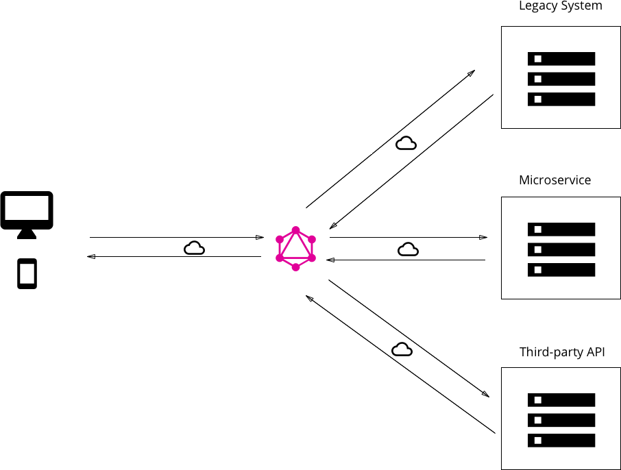
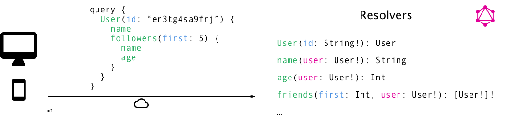

# GraphQL Study

## 核心概念

### SDL（Schema定义语言）

Graphql有自己的类型系统，用于定义一个API的模式。用于写这种模式的语法叫做SDL。

下面有一个如何使用SDL来顶一个简单的`Person`类型的例子:

``` js
type Person {
    name: String!
    age: Int!
}
```

这个类型有两个字段，分别是`name`和`age`，它们的类型分别是`String`和`Int`。在类型后面的`!`是用来说明该字段是不可缺省的字段。

SDL也可以表达类型之间的关系。在一个博客应用的例子中，一个`Person`可能与一个`Post`字段相关联。

``` js
type Post {
    title: String!
    author: Person!
}
```

反过来，我们也可以把`Post`与`Person`的位置换过来:

``` js
type Person {
    name: String!
    age: Int!
    posts: [Post]
}
```

注意，我们在`Person`和`Post`之间创建了一个一对多的关系，因为在`Person`里的`posts`字段是一个Post类型数组。

### 使用查询获取数据

当使用REST API的时候，数据是从特定的终端加载过来的。每个终端返回具有明确的信息结构。这意味着客户端的请求数据被明确的编码在了它所连接的url上。

在GraphQL中所采用的方法是截然不同的。与采用多个终端返回固定的数据结构不同，GraphQL API一般只暴露一个单独的终端。这样做是因为它返回的数据结构是不固定的。相反，它十分灵活并且让客户端决定所需要的数据是什么。

这意味着客户端需要向服务器端发送更多的信息来表达它的数据需求——这种信息被叫做`query`。

#### 基本的查询（Queries）

让我们看一个从客户端向服务器端发送的`query`。

``` js
{
  allPersons {
    name
  }
}
```

在这次查询中的`allPersons`字段被叫做查询的根字段。根字段后面所携带的所有内容都称为查询的负载内容。在这个`query`负载内容中的唯一指定字段就是`name`。

这个`query`将会返回存储在数据库中的所有人的名单。这里是一个简单的响应。

``` js
{
  "allPersons": [
    { "name": "Johnny" },
    { "name": "Sarah" },
    { "name": "Alice" }
  ]
}
```

注意在这个响应中，每一个人都会反回了`name`字段，但是并没有`age`字段。那是因为在`query`中指定了`name`字段。如果希望返回的响应中存在`age`，那么只要在`query`中添加`age`字段就可以了。

GraphQL的主要优势之一就是允许进行嵌套查询。假如你想加载某一个人写的所有post内容。你可以按照你的类型结构去请求信息：

``` js
{
  allPersons {
    name
    age
    posts {
      title
    }
  }
}
```

#### 带参数的查询

在GraphQL中，可以指定某一个字段有零或多个参数。例如`allPersons`字段可能有一个`last`参数，目的是为了返回指定数量的`person`。下面是一个这样的查询：

``` js
{
  allPersons(last: 2) {
    name
  }
}
```

### 使用Mutations更改数据

除了向服务器请求信息之外，大多数应用程序还需要某种方式来更改当前存储在后端的数据。在GraphQL中，这些数据的更改通常使用叫做`mutations`来改变。通常有三种`mutations`:

* 创建新数据
* 更新已存在的数据
* 删除已存在的数据

`mutation`使用与`query`类似的语法结构，除了它们需要以`mutation`关键词开头。这里有一个如何创建一个新的`Person`的例子：

``` js
mutation {
    createPerson(name: "Bob", age: 36) {
        name
        age
    }
}
```

注意，与我们之前写的`query`类似，`mutation`也有一个根字段，这里是`createPerson`。我们也已经了解了每个字段都可以有参数。在这里`createPerson`带有两个参数，它们指定了新的`Person`的`name`和`age`。

类似`query`，我们也可以为`mutation`指定附加内容，在这个`mutation`中我们可以指定新的`Person`的属性。在我们的这个例子里显然这样做没有什么用处，因为我们已经通过参数传递了它们。然后当发送`mutation`的时候也能够查询信息是一个非常大的工具，可以让你在一次`mutation`请求中取回新的信息。

上面的`mutation`服务响应看起来像下面这样：

``` js
"createPerson": {
  "name": "Bob",
  "age": "36",
}
```

你会经常发现一种模式，GraphQL的类型有当新的对象创建的时候由服务器生成的唯一ID。扩展我们的`Person`类型，我们可以向其中添加id，就像这样：

``` js
type Person {
  id: ID!
  name: String!
  age: Int!
}
```

现在，当一个新的`Person`创建的时候，你可以直接在`mutation`的附加信息中询问id，因为这是在客户端事先不存在的信息：

``` js
mutation {
  createPerson(name: "Alice", age: 36) {
    id
  }
}
```

### 使用订阅模式进行实时更新

当今许多应用程序的另一个重要需求是与服务器进行实时连接，以便立即获知有关重要事件的信息。对于这种情况，GraphQL提供了订阅的概念。

当一个客户端订阅了一个事件，它将初始化并且保持与服务器的稳定连接。每当特定的事件触发的时候，服务器会将相应的数据推送给客户端。与遵循典型的“请求 - 响应 - 循环”的`query`和`mutation`不同，订阅模式代表着一种通过客户端发送的数据流。

订阅模式使用和`query`和`mutation`一样的写法，下面有一个例子，我们在`Person`上订阅了一个事件：

``` js
subscription {
  newPerson {
    name
    age
  }
}
```

在客户端将此订阅发送到服务器后，它们之间将建立连接。然后无论何时执行新的`mutation`以创建新的`Person`，服务器都会将关于这个`Person`的信息发送给客户端：

``` js
{
  "newPerson": {
    "name": "Jane",
    "age": 23
  }
}
```

### 定义一个Schema

现在你已经对`query`、`mutation`、`subscriptions`有所了解，让我们将它们放在一起并且学习如何写一个Schema，让你能够去执行目前为止的例子。

在使用GraphQL的时候，`schema`是重点概念之一。它指定了api的功能并定义了客户端如何请求数据。它通常被视为服务器和客户端之间的*合约*。

通常，一个`schema`是一个GraphQL类型的集合。但是，在为api编写`schema`时，有一些特殊的根类型：

``` js
type Query { ... }
type Mutation { ... }
type Subscription { ... }
```

`Query`、`Mutation`和`Subscription`类型是客户端发送请求的入口点。为了使用我们之前所看到的`allPersons`请求，`Query`类型如下改写：

``` js
type Query {
    allPersons: [Person!]!
}
```

`allPersons`作为API的根字段，思考一下我们之前的例子：我们向`allPersons`字段添加了`last`参数。我们再次改写：

``` js
type Query {
    allPersons(last: Int): [Person!]!
}
```

同样对于`createPerson`的`mutation`操作，我们必须在`Mutation`类型里添加根字段：

``` js
type Mutation {
  createPerson(name: String!, age: Int!): Person!
}
```

注意到这里的根字段带有两个参数，新的`Person`的`name`和`age`属性。

最后对于`subscriptions`，我们必须添加`newPerson`根字段：

``` js
type Subscription {
  newPerson: Person!
}
```

把它们放在一起，这是你在本章中看到的所有`query`和`mutation`的完整schema：

``` js
type Query {
  allPersons(last: Int): [Person!]!
}

type Mutation {
  createPerson(name: String!, age: Int!): Person!
}

type Subscription {
  newPerson: Person!
}

type Person {
  name: String!
  age: Int!
  posts: [Post!]!
}

type Post {
  title: String!
  author: Person!
}
```

## 整体架构

graphql仅作为规范发布。这意味着GraphQL实际上不过是一个长文档，详细描述了GraphQL服务器的行为。

如果你想要是用GraphQL，你就必须自己去构建GraphQL服务。你可以选择任何语言或者使用像是[Graphcool](http://www.graph.cool/)，它提供了一个强大的开箱即用的GraphQL API。

### 使用案例

在这个部分，我们将介绍三种不同的使用GraphQL服务的架构。

1. 直接连接数据库的GraphQL服务。
2. GraphQL 服务作为第三方库或者在之前系统基础上面的一层，通过一个GraphQL API集成它们。
3. 一个综合以上的混合方式

所有这三种架构都代表了graphql的主要用例，并展示了它在项目中的灵活性。

#### 直接连接数据库的GraphQL服务

这种架构对于新建项目来说是最普遍的架构。在设置中，你要有一个实现了GraphQL规范的服务器。当一个`query`到达服务器后，服务器会读取`query`里负载的内容并且向数据库请求必要的数据。这个过程叫做*解析*`query`。然后按照规范的描述构建响应，然后返回给客户端。

这里重点注意的是GraphQL的*transport-layer agnostic（传输层是不确定的）*。这意味着它可以用于任何可用的网络协议。因此它可以基于TCP、Websocket等等来实现一个GraphQL服务。

GraphQL也不会关心数据库及存储在数据库中的数据格式。你可以使用任何一种SQL数据库，像[AWS Aurora](https://aws.amazon.com/rds/aurora)或者是NoSQL数据库，像MongoDB。


#### 集成了现有系统的graphql层

GraphQL的另一个主要用例是将多个现有系统集成在一个统一的graphql api后面。这对于那些拥有传统基础设施和许多不同API的公司来说尤其具有吸引力，这些API已经使用并发展了很多年并且现在承担了很高的维护负担。这些遗留系统的一个主要问题是如果要新创建的产品去访问多个系统是几乎不可能的。

在这种情况下，GraphQL可以用来统一这些现有的系统，并将它们的复杂性隐藏在一个很好的GraphQL API后面。通过这样的方式，新的客户端可以很简单的从GraphQL服务获取它们需要的数据。然后GraphQL服务负责从现有系统中获取数据并将其包装成为GraphQL响应格式。

就像上一个架构中，GraphQL服务不关心所使用的数据类型，这次它不关心它需要获取解析`query`所需的数据的数据源。



#### 混合式

最后，我们也可以将两种方法混合使用，构建一个能够连接数据库同事也可以与已存在的系统或第三方系统通信的GraphQL服务。

当服务器接受到一个`query`的时候，它将解析它并且将来自数据库或者其他API里拿到的数据进行检索。


### 解析函数

但是我们如何使用GraphQL获得这种灵活性？它是如何如此适合不同的使用场景的？

正如你在上一章学习到的，一个GraphQL的`query`(或者`mutation`)的负载内容包括很多个字段。在GraphQL服务器的实现中，每一个字段实际上是对应一个叫做`resolver`的函数。`resolver`函数的唯一目的是获取对应它这个字段的数据。

当一个服务器接受到一个`query`，它将会调用在`query`的负载内容里每个字段的对应函数。它因此解析了`query`并且能够为每个字段解析正确的数据。一单所有的`resolver`（解析器）返回了数据，服务器将按照`query`描述的格式包装并且发送回客户端。




### GraphQL 客户端库

GraphQL对于前端开发人员来说特别好，因为它完全消除了REST API所带来的许多不便和缺点，例如请求的内容过多和多次请求内容。

复杂性被放在了服务器端，那里功能强大的机器可以负责繁重的计算工作。客户端不必知道它获取的数据实际来自何处，并且可以使用单个，连贯且灵活的api。

让我们考虑一下在GraphQL中引入的主要变化是从一个非常必要的数据获取方法转变为一个纯粹的声明式转换。
当从其他API获取数据时，大多数应用程序将不得不经历以下步骤：

1. 构造并发送http请求，例如在JavaScript中使用的`fetch`。
2. 接受并且解析服务器响应。
3. 本地存储数据（无论是临时存储还是持久化存储）
4. 在UI中展示数据。

使用声明式数据获取的方法，客户端只需要做下面两件事：

1. 描述数据的要求。
2. 在UI中展示数据。

所有较低级别的网络任务以及存储数据应该被抽象出来，并且数据依赖性的声明应该是主要部分。

这正是像Relay或Apollo这样的GraphQL客户端库可以让你做的事情。他们提供了抽象的内容，您需要能够专注于应用程序的重要部分，而不必处理基础结构的重复实施。

## 高级教程之客户端

在前端使用GraphQL API进行开发是一种开发新抽象内容的绝佳机会并且帮助在客户端实现通用功能。让我们考虑一些你希望在你的应用中具有的“基础设施”：

* 无需构造HTTP请求直接发送`query`和`mutation`。
* 视图层集成
* 缓存
* 验证并且基于schema优化查询

当然，没有什么能阻止你使用纯http来获取你的数据，然后自己处理所有的数据，直到正确的信息在你的UI中出现。但是GraphQL提供了抽象出你在这个过程中通常需要做的大量手动工作的能力，并且让你专注于应用程序的真正重要部分！

> 目前有两个主要的GraphQL客户端可用。第一个是[Apollo Client](https://github.com/apollographql/apollo-client)，它是一个社区驱动的努力，为所有主要开发平台构建功能强大且灵活的graphql客户端。第二个叫做[Relay](https://facebook.github.io/relay/)，它是Facebook的出品的GraphQL客户端，大大优化了性能，并且只能在Web上使用。

### 直接发送查询和突变

GraphQL一个主要的优点是允许你能够以声明的方式获取或更新数据。换句话说，我们在api抽象的层次上上升了一步，不再需要自己处理低级联网任务。

当你像之前的使用纯HTTP方式（像JavaScript中的`fetch`或者是IOS中的`NSURLSession`）从API获取数据的时候，使用GraphQL你需要做的所有事情就是写一个按照你的数据要求声明数据的`query`。并且让系统关注在发送的请求和处理响应。这正是graphql客户端所要做的。

### 视图层集成与UI更新

一次由GraphQL客户端处理并返回的服务响应，请求数据最后会在UI上展示。依赖于浏览器和你所使用的框架，对于UI如何更新通常有一些不同的方法可以使用。

拿React作为例子，GraphQL客户端使用[higher-order components](https://reactjs.org/docs/higher-order-components.html)的概念在React框架引擎下（under the hood）来获取所需要的数据并且十七在组件的props属性中可用。通常，GraphQL的声明式特点与函数式编程技术（[functional reactive programming](https://en.wikipedia.org/wiki/Functional_reactive_programming)）紧密结合。这两者可以形成一个强大的组合，视图只是简单地声明它的数据依赖关系，而UI则与您选择的frp层相连。

### 缓存查询结果：概念和策略

在大多数应用程序中，您需要维护之前从服务器获取的数据缓存。本地缓存信息对于提供流畅的用户体验并将用户的数据计划带出负载至关重要。

一般来说，在缓存数据时，通常就是将远程获取的信息放入本地存储中，以后可以从中检索。对于GraphQL，简单的方法是简单地将GraphQL查询的结果放入存储中，并且每当完全相同的查询再次执行时，只返回以前存储的数据。事实证明，这种方法对于大多数应用来说效率非常低。

更有利的方法是事先对数据进行归一化处理。这意味着（潜在嵌套的）查询结果变得平坦，并且存储内容将只包含可以用全局唯一ID引用的单个记录。如果你想更多地了解这一点，[Apollo blog](https://dev-blog.apollodata.com/the-concepts-of-graphql-bc68bd819be3)在这个话题上有很好的文章。

### 构建时的模式验证与优化

由于架构包含有关客户端可能对graphql API做什么的所有信息，因此有很大机会验证并可能优化客户端在构建时已发送的查询。当构建环境可以访问模式时，它可以实质上解析项目中所有的graphql代码，并将其与模式中的信息进行比较。
这会在应用程序进入实际用户的手中之前捕获拼写错误和其他错误，其中错误的后果会更加剧烈。

### 整合视图和数据依赖关系

## 服务器端

GraphQL通常被认为为一种以前端为中心的API技术，因为它使客户能够以比以前更好的方式获取数据。但是API本身当然是在服务器端实现的。对于服务器还有很多好处，因为GraphQL使服务器开发人员能够专注于描述可用数据，而不是实现和优化特定接口。

### GraphQL的执行

GraphQL不只是指定一种方法来描述Schema，也不是仅仅是一种以从这些Schema中检索数据的查询语言，而是关于如何将这些查询转换为结果的实际执行算法。这个算法的核心非常简单：query的逐个字段遍历，对于每个字段执行相应的`resolver`函数。所以，假设我们有以下模式：

``` js
type Query {
  author(id: ID!): Author
}

type Author {
  posts: [Post]
}

type Post {
  title: String
  content: String
}
```

下面是我们可以发送到具有该Schema的服务器的查询：

``` js
query {
  author(id: "abc") {
    posts {
      title
      content
    }
  }
}
```

首先要看的是查询中的每个字段都可以与一个类型关联:

``` js
query: Query {
  author(id: "abc"): Author {
    posts: [Post] {
      title: String
      content: String
    }
  }
}
```

现在我们会很容易的发现在我们的服务器上运行着对应字段的解析器，执行从查询类型开始，并且先进行宽度优先遍历。这意味着我们会先去运行`Query.author`的解析器。然后我们会得到解析器返回的结果，并把它传递给它的子项，也就是`Author.posts`的解析器。在下一级，结果是一个列表。所以在这种情况下，执行算法在每一项都执行一次。所以执行如下所示：

``` js
Query.author(root, { id: 'abc' }, context) -> author
Author.posts(author, null, context) -> posts
for each post in posts
  Post.title(post, null, context) -> title
  Post.content(post, null, context) -> content
```

最后，执行算法将所有内容放在一起形成正确的结果并返回它。

有一件事情要注意，大多数的GraphQL服务的实现都会提供默认解析器。因此你不必为每个字段都指定解析器函数。例如，在GraphQL.js中，当解析器的父对象包含具有正确名称的字段时，不需要指定解析器。

### Batched Resolving

你可能会注意到上面执行策略的有一点傻（that it’s somewhat naive）。例如，如果你有一个从后端api或数据库中提取数据的解析器，那么在执行一个查询期间可能会多次调用该后端。让我们想象一下从一些posts里获取author，像是这样：

``` js
query {
  posts {
    title
    author {
      name
      avatar
    }
  }
}
```

如果这些是博客上的帖子，很可能很多帖子都会有相同的作者。所以如果我们需要调用API来获取每个author对象，我们可能会无意中会发出多个同样的请求。例如：

``` js
fetch('/authors/1')
fetch('/authors/2')
fetch('/authors/1')
fetch('/authors/2')
fetch('/authors/1')
fetch('/authors/2')
```

我们如何解决这个问题？通过让我们获取数据更聪明一些，我们可以将获取数据的方法包装成为一个实用的方法，该方法会等待所有的解析器都执行之后，然后确保每一项只执行一次获取数据：

``` js
authorLoader = new AuthorLoader()

// Queue up a bunch of fetches
authorLoader.load(1);
authorLoader.load(2);
authorLoader.load(1);
authorLoader.load(2);

// Then, the loader only does the minimal amount of work
fetch('/authors/1');
fetch('/authors/2'); 
```

我们有没有更好的方法？有的，如果我们的API支持批量请求，我们只能对后端进行一次获取，如下所示：

``` js
fetch('/authors?ids=1,2')
```

这也可以封装在上面的加载器中。

在JavaScript中，上述策略可以使用名为[DataLoader](https://github.com/facebook/dataloader)的实用程序来实现，并且其他语言也有类似的实用程序。

## 工具和生态系统

### 内省

schema的设计者已经知道schema是什么样子，但客户端如何才能发现通过GraphQL API可访问的内容？我们可以通过查询`__schema`元字段来向GraphQL询问这些信息，该元字段在每个规范的查询根类型上始终可用。

``` js
query {
  __schema {
    types {
      name
    }
  }
}
```

以这个schema定义为例：

``` js
type Query {
  author(id: ID!): Author
}

type Author {
  posts: [Post!]!
}

type Post {
  title: String!
}
```

如果我们要发送上面提到的内省查询，我们会得到以下结果：

``` js
{
  "data": {
    "__schema": {
      "types": [
        {
          "name": "Query"
        },
        {
          "name": "Author"
        },
        {
          "name": "Post"
        },
        {
          "name": "ID"
        },
        {
          "name": "String"
        },
        {
          "name": "__Schema"
        },
        {
          "name": "__Type"
        },
        {
          "name": "__TypeKind"
        },
        {
          "name": "__Field"
        },
        {
          "name": "__InputValue"
        },
        {
          "name": "__EnumValue"
        },
        {
          "name": "__Directive"
        },
        {
          "name": "__DirectiveLocation"
        }
      ]
    }
  }
}
```

正如你所看到的，我们在schema中查询所有类型。我们获得了我们定义的对象类型和标量类型。我们甚至可以检查内省类型！(We can even introspect the introspection types!)

在内省类型中，还有更多的名称可用。这是另一个例子：

``` js
{
  __type(name: "Author") {
    name
    description
  }
}
```

在这个例子中，我们使用__type元字段查询单个类型，并询问其名称和描述。这是这个查询的结果：

``` js
{
  "data": {
    "__type": {
      "name": "Author",
      "description": "The author of a post.",
    }
  }
}
```

正如你所看到的，自省是graphql的一个非常强大的功能，我们只是简单的了解了一下。该规范更详细地介绍了内省模式中可用的字段和类型。

GraphQL生态系统中提供的许多工具都使用自检系统来提供令人惊叹的功能。想想文档浏览器，自动完成，代码生成，一切皆有可能！在构建和使用GraphQL APIs时，您将需要的最有用的工具之一是大量使用自检。它被称为**GraphiQL**。

### GraphiQL

GraphiQL是用于编写，验证和测试graphql查询的浏览器内IDE。它具有一个用于graphql查询的编辑器，配备了自动完成和验证以及一个文档浏览器，可以快速查看架构的结构（由内省提供支持）。

它是一个令人难以置信的强大的开发工具。它允许您在GraphQL服务器上调试和尝试查询，而无需通过curl编写普通的GraphQL查询。

## 安全